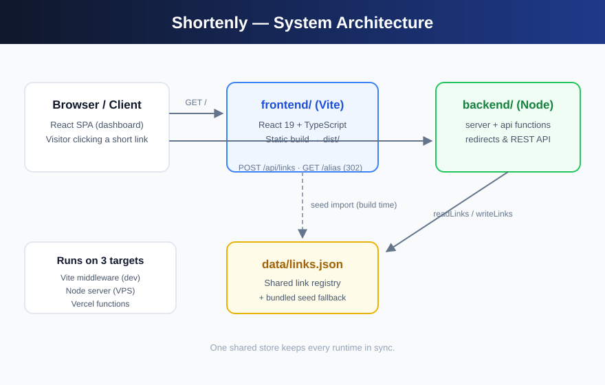
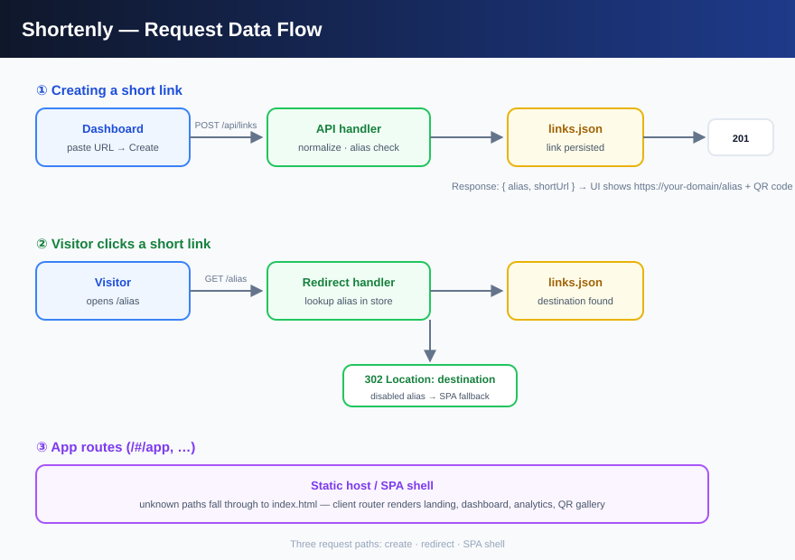
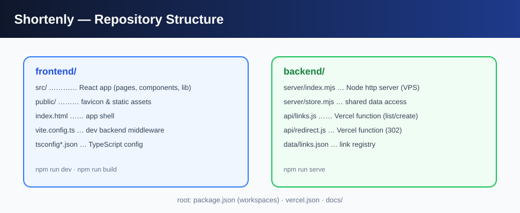

# Shortenly

<p align="center">
  
  
  
  
  
</p>

**Shortenly** is a full-stack URL shortener — turn long URLs into short, memorable links with a beautiful analytics dashboard and QR codes. Think bit.ly, but self-hostable and yours.

- 🔗 **Clean short links** — `https://your-domain/alias` → instant `302` redirect
- 📊 **Analytics dashboard** — clicks, referrers, countries, devices, 30-day trends
- 📱 **QR code gallery** — every link gets a downloadable QR code
- ⚙️ **Custom aliases** — brand your links (`/summer`, `/launch`) or auto-generate them
- 🚀 **Three runtimes, one codebase** — Vite dev middleware, Node server, or Vercel serverless

## Architecture

Shortenly is an npm-workspaces monorepo with a React frontend and a Node backend that share a single JSON link registry.



## How a request flows



1. **Create** — the dashboard `POST`s to `/api/links`; the handler normalizes the URL, checks alias collisions, and persists the link.
2. **Redirect** — a visitor hitting `/alias` gets looked up in the store and answered with `302 Location: <destination>`. Disabled links fall through to the app shell instead.
3. **SPA** — unknown paths serve the app shell so client-side routes (landing, dashboard, analytics) keep working.

## Repository structure



```text
Shortenly/
├── frontend/               # React 19 + Vite + TypeScript app
│   ├── src/
│   │   ├── components/     # Landing, dashboard, UI primitives
│   │   ├── pages/          # Router pages (overview, links, analytics, QR, redirect)
│   │   ├── lib/            # links data layer, theme
│   │   └── styles/
│   ├── public/             # Static assets
│   ├── index.html
│   ├── vite.config.ts      # Includes dev-server redirect + API middleware
│   └── tsconfig*.json
├── backend/                # Node backend (server + serverless)
│   ├── server/
│   │   ├── index.mjs       # Zero-dependency http server (serves dist/ + redirects + API)
│   │   └── store.mjs       # Shared read/write access to the link registry
│   ├── api/
│   │   ├── links.js        # Vercel function — GET/POST /api/links
│   │   ├── redirect.js     # Vercel function — GET /<alias> → 302
│   │   └── links-seed.json # Bundled seed fallback for Vercel's ephemeral FS
│   └── data/
│       └── links.json      # The link registry (shared by every runtime)
├── docs/                   # Diagrams used in this README
├── package.json            # npm workspaces: frontend + backend
└── vercel.json             # Monorepo build + function wiring
```

## Quick start

Requires Node 18+.

```bash
git clone https://github.com/musama-dev/Shortenly.git
cd Shortenly
npm install

# Development — frontend on :5173 with redirects & API built in
npm run dev
```

Open `http://localhost:5173`, create a link, and share it as
`http://localhost:5173/<alias>` — the dev server redirects it just like production.

### Production build + Node server

```bash
npm run build     # frontend → dist/
npm run serve     # backend on http://localhost:3030
```

The Node server serves the built app **and** the redirect/API backend from one port:

```bash
$ curl -i http://localhost:3030/summer
HTTP/1.1 302 Found
Location: https://example.com/campaigns/summer-sale-2026
```

## API

| Method | Endpoint      | Description                                             |
| ------ | ------------- | ------------------------------------------------------- |
| `GET`  | `/api/links`  | List all links                                          |
| `POST` | `/api/links`  | Create a link — `{ alias?, title?, destination }`       |
| `GET`  | `/<alias>`    | Redirect to the destination (`302`)                     |

**Create a link**

```bash
curl -X POST http://localhost:3030/api/links \
  -H "Content-Type: application/json" \
  -d '{ "alias": "launch", "destination": "https://example.com/launch-page" }'
```

- `201` → link created (returned as JSON)
- `409` → alias already in use
- `400` → invalid JSON or missing destination

**Resolve a link**

```bash
curl -i http://localhost:3030/launch   # 302 → destination
```

Links with `"status": "disabled"` are never redirected — the request falls through to the app shell.

## Configuration

| Variable        | Where    | Purpose                                                                 |
| --------------- | -------- | ----------------------------------------------------------------------- |
| `VITE_BASE_URL` | frontend | Public base for generated links (e.g. `https://sho.example.edu`). Optional — defaults to the app's own origin, which is correct on Vercel. |
| `HOST`          | backend  | Bind address for the Node server (default `0.0.0.0`).                   |
| `DIST_DIR`      | backend  | Override the frontend build directory (default `frontend/dist`).        |

## Deployment

### Vercel (recommended)

The repo is Vercel-ready — `vercel.json` wires the monorepo build and the serverless functions together:

1. Push this repo to GitHub.
2. In [vercel.com/new](https://vercel.com/new), import `musama-dev/Shortenly`.
3. Deploy. Vercel reads `vercel.json`:
   - builds the frontend workspace and serves `dist/`,
   - routes `/api/*` to `backend/api/*` functions,
   - routes every other path to `backend/api/redirect.js` (short-link lookup → `302`, else the app shell).

Your links go live as `https://<project>.vercel.app/<alias>` — no env vars needed.

> **Note:** Vercel's filesystem is ephemeral. Seeded links redirect out of the box; links created at runtime persist per-invocation only. For durable writes, swap `backend/server/store.mjs` for a database (Vercel Postgres, Upstash Redis, …) — it's the single data-access module, so nothing else changes.

### Node server (VPS / self-host)

```bash
npm install && npm run build
HOST=0.0.0.0 npm run serve          # listens on :3030
```

Point your domain's DNS at the server and build with `VITE_BASE_URL=https://sho.example.edu` to brand the generated links.

## Tech stack

| Layer    | Choice                                                          |
| -------- | --------------------------------------------------------------- |
| Frontend | React 19, React Router 7, TypeScript 6, Vite 8                  |
| Backend  | Zero-dependency Node `http` server · Vercel serverless functions |
| Storage  | JSON file registry (`backend/data/links.json`)                   |
| Tooling  | npm workspaces, Oxlint                                           |

## License

MIT
